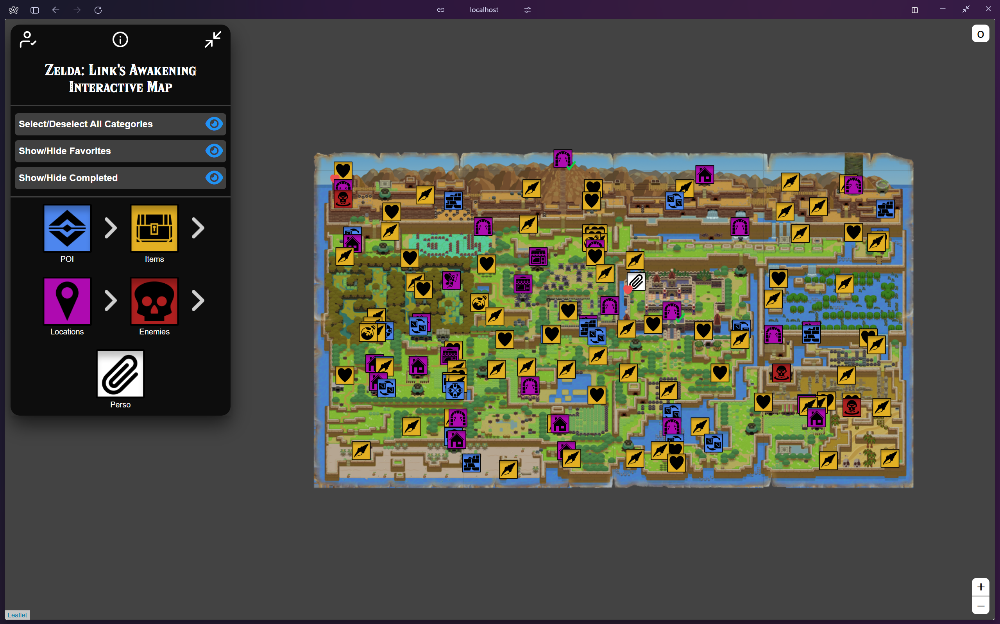

# 🗺️ Zelda: Link's Awakening Interactive Map

Ce projet est une carte interactive du jeu **The Legend of Zelda: Link's Awakening**, conçue pour permettre aux joueurs de suivre leur progression, marquer des éléments et explorer facilement l'univers du jeu. Elle utilise des technologies web modernes combinées à une base de données MySQL pour gérer les marqueurs, les utilisateurs et leurs données personnalisées.



## 🔧 Technologies utilisées

- **Frontend :**
  - HTML5, CSS3, JavaScript
  - [Leaflet.js](https://leafletjs.com/) pour la cartographie
  - Figma pour les icônes
- **Backend :**
  - PHP 8.x (via Docker)
  - MySQL (via Docker)
  - API REST interne en PHP
- **Outils :**
  - Docker (environnement de développement)
  - Artillery (tests de charge)
  - Export SQL automatique pour sauvegarde (`autoExport.php`)

## ⚙️ Fonctionnalités principales

- 🔍 Affichage d'une carte interactive avec marqueurs.
- 👤 Inscription, connexion et gestion des comptes utilisateurs.
- 📌 Ajout, modification, suppression de marqueurs personalisés.
- 🧠 Suivi des marqueurs favoris et complétés par utilisateur.
- 💾 Export automatique de la base de données au format SQL (`backup.sql`).
- 📧 Formulaire de récupération de mot de passe.
- 📈 Tests de performances via Artillery (`stress-load.yml`).

## 📁 Structure du projet

```text
.
├── src/
|   ├── backup/                # Backup BDD hebdo
|   ├── css/                   # Feuilles de styles
|   ├── fonts/                 # Style d'écriture
|   ├── img/                   # Images et icônes
|   ├── libs/                  # Librairies tierces
|   └── scripts/
│       └── management/
|           ├── account/       # Actions compte utilisateur
│           └── bdd/           # Export, import, gestion BDD
│       └── services/          # Services tierces
|   └── tests/
|       ├── screenshots/       # Capture visuels des tests
|       ├── test-results/      # Historique des résultats des tests
│       └── testsFiles/        # Fichier de tests principaux
|   └── index.php              # Point d’entrée de l'application
├── docker-compose.yml         # Stack PHP + MySQL
└── README.md                  # Guide & Documentation
```

## 🐳 Mise en place du projet avec Docker Desktop

Ce projet utilise Docker pour simplifier le déploiement de l’environnement PHP + MySQL.

### ✅ Prérequis

- [Docker Desktop](https://www.docker.com/products/docker-desktop/)

---

### 🔧 Étapes

#### 1. 📁 Cloner le dépôt

```bash
git clone https://github.com/Unicron03/map-LA-upg.git
cd map-LA-upg
```

#### 2. ▶️ Lancer les conteneurs
```bash
docker-compose up -d
```

#### 3. 🌐 Accéder à l'application
- Frontend : http://zeldala.duckdns.org/ OU localhost:8080
- Backend (MySQL NON WEB) : port 3306

#### 4. ⏹️ Arrêter les conteneurs
```bash
docker-compose down
```

## 👥 Contributeurs

Merci aux personnes ayant participé au développement du projet :

| [](https://github.com/Unicron03) | [](https://github.com/Johnmclf) | [](https://github.com/Jores02) |
|:--:|:--:|:--:|
| [@Unicron03](https://github.com/Unicron03) <br> *Enzo Vandepoele* | [@Johnmclf](https://github.com/Johnmclf) <br> *Johnmclf* | [@Jores02](https://github.com/Jores02) <br> *AHOUANDOGBO Amen* |
